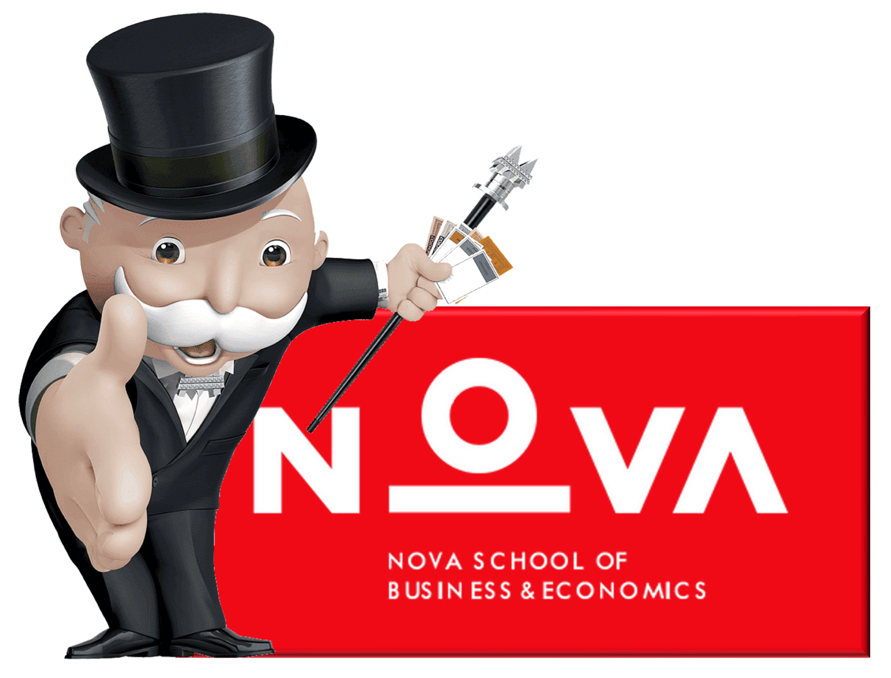

# Monopoly Nova SBE

<p align="center">

</p>

## Why

This was the final project for the Introduction to Programming course at Nova SBE, developed during my Master's in Management. The project was done in collaboration with Martim, Timm and Emily.

## Usage

- Press "s" to save the current game

### To start a game from scratch:

```
python3 play.py <PLAYER_1> <PLAYER_2> <PLAYER_3> <PLAYER_4>
```

Example:

```
python3 play.py Fred Martim Timm Emily
```

### To load a saved game:

```
python3 play.py <SAVED_GAME.json>
```

Example:

```
python3 play.py game3.json
```
